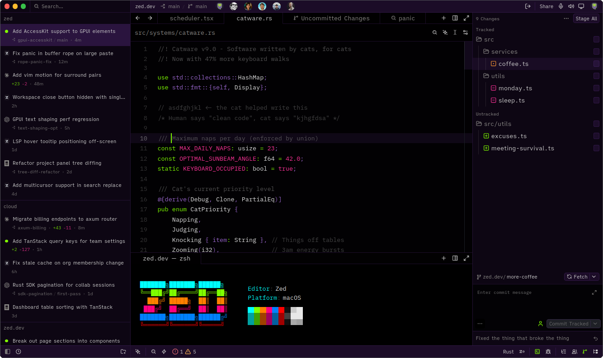

# NGE Themes for Zed

A collection of color themes for the [Zed editor](https://zed.dev) inspired by the iconic aesthetics of **Neon Genesis Evangelion (NGE)**.

Currently in its initial release, this extension features the legendary **EVA-01** color scheme (Purple and Green with orange accents), crafted for dark mode coding sessions.

---

## 📸 Preview

### EVA-01 Dark

---

| Theme Name | Appearance | Description |
| :--- | :---: | :--- |
| **EVA-01 Dark** | Dark | The classic Unit-01 palette: deep purple base (`#1B0C27`), electric violet panels, and vibrant neon green (`#80FF00`) accents. |

---

## 📦 Installation

### Manual Installation (Local Development)

If you cloned or downloaded this repository locally:

1. Open Zed.
2. Open the command palette (`Ctrl+Shift+P` / `Cmd+Shift+P`) and choose **zed: install dev extension**.
3. Select the `nge-themes` directory.

---

## ⚙️ Usage

Once installed:
1. Open the theme selector via `Ctrl+K Ctrl+T`, or through the settings.
2. Select **EVA-01 Dark**.

---

## 📄 License

This project is open-source and available under the [MIT License](LICENSE).
